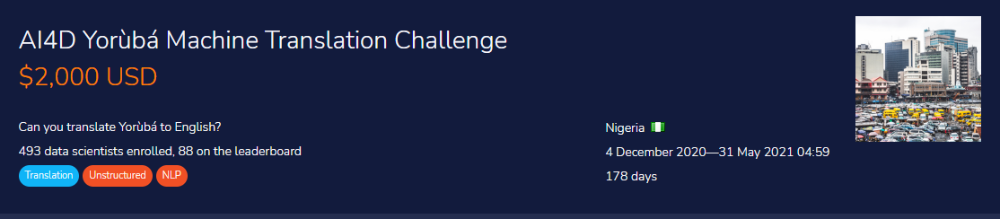
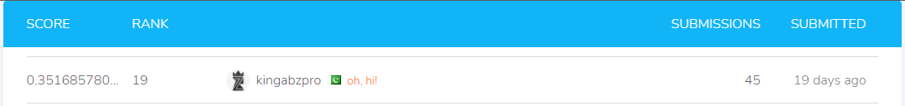

# Machine translation using `simpletransformers` *Yorùbá to English*

Machine translation models are very sensitive to the domain they were trained on which limit their generalization to multiple domains of interest like legal or medical domains. The problem is more severe in low-resource languages like Yorùbá where the most available datasets used for training are in the religious domain like JW300. How can we train MT models to generalize to multiple domains or quickly adapt to new domains of interest? In this challenge, you are provided with 10,000 Yorùbá to English parallel sentences sourced from multiple domains like news articles, ted talks, movie transcripts, radio transcripts, software localization texts, and other short articles curated from the web. Your task is to train a multi-domain MT model that will perform very well for practical use cases.

The goal of this challenge is to build a machine translation model to translate sentences from Yorùbá language to English language in several domains like news articles, daily conversations, spoken dialog transcripts and books. Your solution will be judged by how well your translation prediction is semantically similar to the reference translation.

**About AI4D-Africa; Artificial Intelligence for Development-Africa Network (**[**ai4d.ai**](https://ai4d.ai/))

The training data consist of 10,054 parallel Yorùbá-English sentences from different domains like news, Yorùbá proverbs, movie transcript, ted talks, radio broadcast transcript, localization translation, and books.

**Variable definitions**

- English: English sentences
- Yoruba: Yoruba sentences

**Files available for download:**

- **Train.csv** - contains the target. This is the dataset that you will use to train your model.
- **Test.csv-** resembles Train.csv but without the target-related columns. This is the dataset on which you will apply your model to.
- **SampleSubmission.csv -** shows the submission format for this competition, with the ID column mirroring that of Test.csv and the ‘English column containing your translations. The order of the rows does not matter, but the names of the ID column must be correct.

# My solution

This library is based on the Transformers library by HuggingFace. Simple Transformers lets you quickly train and evaluate Transformer models. Only 3 lines of code are needed to initialize a model, train the model, and evaluate a model.

**Supports**

- Sequence Classification

- Token Classification (NER)

- Question Answering

- Language Model Fine-Tuning

- Language Model Training

- Language Generation

- T5 Model

- Seq2Seq Tasks

- Multi-Modal Classification

- Conversational AI.

- Text Representation Generation.

## `Yoruba` Model

Using simple transformer seq2seq I have downloaded `Helsinki-NLP/opus-mt-mul-en` which work best in our case and using specific `Seq2SeqArgs` to set arguments of model.

**Args**

- num_train_epochs = 35
- batch_size = 32
- max_length = 120
- src_lang ="yor"
- tgt_lang ="en_XX"

# Results

